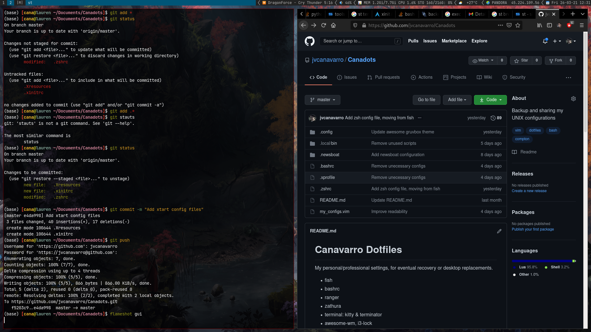

# Canadots

Personal configuration files and knowledge vault, for backup and machine recovery.



## Structure

```
Canadots/
├── System/          # Obsidian vault (notes, indexes, raw)
├── pacman.conf      # Arch Linux package manager config
└── xorg.conf        # X.Org display server config
```

## Obsidian Vault

The `System/` directory is an [Obsidian](https://obsidian.md) vault tracked via the [obsidian-git](https://github.com/denolehov/obsidian-git) plugin.

### Plugins

| Plugin | Purpose |
|---|---|
| [obsidian-git](https://github.com/denolehov/obsidian-git) | Automatic git backup |
| [Calendar](https://github.com/liamcain/obsidian-calendar-plugin) | Daily notes navigation |
| [Linter](https://github.com/platers/obsidian-linter) | Note formatting and consistency |
| [Tag Wrangler](https://github.com/pjeby/tag-wrangler) | Tag management |
| [Tag Folder](https://github.com/vrtmrz/obsidian-tagfolder) | Tag-based file browsing |
| [Icon Folder](https://github.com/FlorianWoelki/obsidian-icon-folder) | Folder icons |

### Theme

[Typewriter](https://github.com/crashmoney/obsidian-typewriter) with system color scheme and translucency enabled.

### Vault Layout

```
System/
├── Indexes/    # High-level topic indexes (work, engineering, books, etc.)
├── Notes/      # Atomic notes and reference documents
└── Raw/        # Unprocessed / inbox content
```
